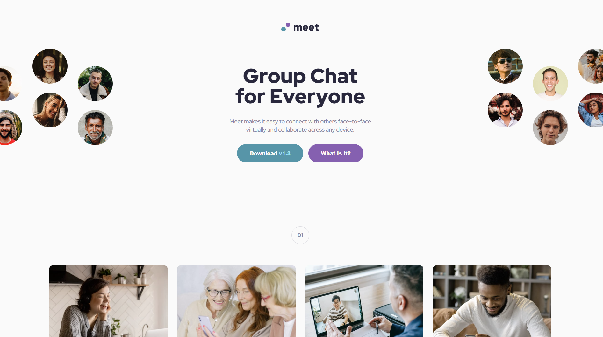
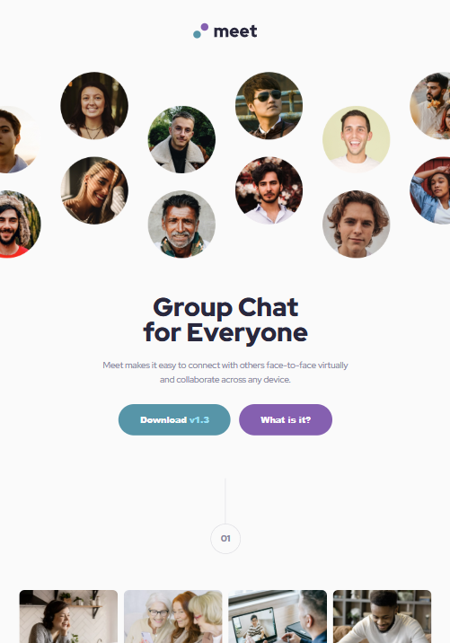
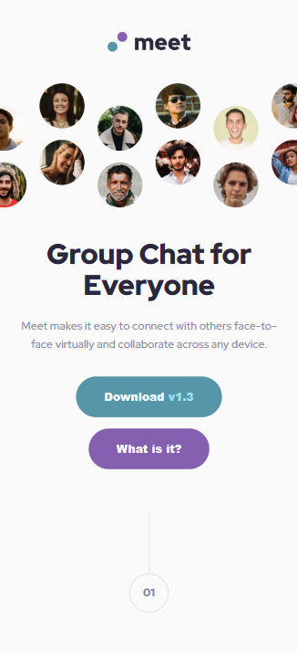

# Meetings Landing Page

  
  
  
  

   
   

  
  

---

## About The Project

This is a responsive landing page for **"Meetings"**, a group chat and collaboration platform. The project focuses on a clean, modern UI with a **mobile-first** approach, ensuring the layout looks great on phones, tablets, and desktop screens.

It demonstrates the use of semantic HTML, advanced CSS layout techniques (Grid/Flexbox), and SCSS for styling organization.

### Key Features

- **Mobile-First Workflow:** Styles are written for mobile first, then adapted for larger screens using min-width media queries.
- **SCSS Nesting & Variables:** Uses Sass variables for colors/fonts and nesting for cleaner code.
- **Responsive Images:** Different hero images and background layouts for Mobile, Tablet, and Desktop.
- **Modern CSS:** usage of CSS Grid and Flexbox for layout management.

---

## Screenshots

 
  <h3>Desktop View</h3>
  

 

  

    <h3>Tablet View</h3>
    
  

  

    <h3>Mobile View</h3>
    
  

---

## Built With

- **[HTML5](https://developer.mozilla.org/en-US/docs/Web/HTML)** - Semantic structure
- **[SCSS / SASS](https://sass-lang.com/)** - CSS Preprocessor for nested rules and variables
- **[Flexbox & Grid](https://css-tricks.com/snippets/css/a-guide-to-flexbox/)** - Layout engines

---
